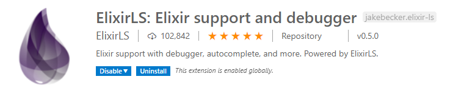

  

# Elixir workshop

The goal of this workshop is to learn the basics of the Elixir programming language. We have compiled a set of exercises to work on to get you started. If you want to incorperate other technologies or facets of the programming language or surrounding technologies, you are more than welcome to do so. 

The exercises in this workshop is based on the base exercise sets, which can be found [**here.**](https://github.com/bergenpolyglotprogrammers/exercises). Each set of exercises contains different exercises but laid out the same way and roughly the same difficulty progression.

## :desktop_computer: Setup

:wrench: To get started, you will need to download Elixir. You can find the correct installer / command at [elixir-lang.org](https://elixir-lang.org/install.html).

:wrench: We also recommend you use [Visual Studio Code](https://code.visualstudio.com/Download) with the `ElixirLS` extension, which can be found in the VS Code marketplace. 

  

:wrench: After you have installed Elixir, visit the `elixir_workshop` folder and run `mix test`. This folder contains a `mix`-project that you can use to fill in your code. 

## Progression

- **Task 1** - Introduces the simples concepts: input, output, compiling and running.
- **Task 2** - Works with loops, conditionals, objects, etc.
- **Task 3** - Works with file io, sorting and filtering lists, etc.
- **Project** - Introduces a bigger project to spend the rest of the time on. This usually includes talking with external web services, databases and touches on the full feature set of a programming language.

## Exercises

- [Task 1 - Password Validation](./set1/README.md)
- [Task 2 - Karvonen Heart Rate](./set1/README.md)
- [Task 3 - Sorting Records](./set1/README.md)
- [Project - Jeopardy](./project.md)